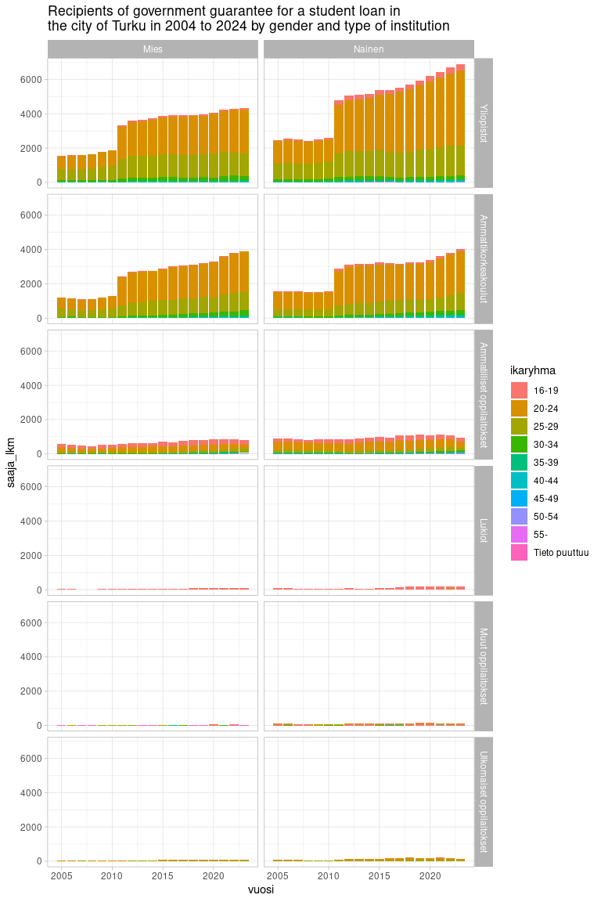

<!-- badges: start -->

[](https://ropengov.org/)
[](https://github.com/rOpenGov/geofi/actions/)
[](https://www.repostatus.org/)
[](https://app.codecov.io/gh/rOpenGov/kelaopendata)
[](https://www.r-pkg.org/pkg/kelatools)
<!-- badges: end -->

# kelaopendata - Access open data from National social insurance institution of Finland

Finnish national social insurance institution
[Kela](https://www.kela.fi/) publishes open data on recipients,
reimbursements and costs of various social security benefits in Finland
at <https://www.avoindata.fi/data/fi/organization/kela>.
`kelaopendata`-package takes advantage of modern big data technologies
such as [duckdb](https://duckdb.org/) and [Apache
Parquet](https://parquet.apache.org/) and provides fast and
straightforward access to data.

Below is a one example on how you can access data using `kelaopendata`.
Please have a closer look at the
[vignettes](https://ropengov.github.io/kelaopendata/articles/index.html)
for more comprehensive use cases.

## Installation and use

``` r
# Not yet published in CRAN

# Install development version from GitHub
remotes::install_github("rOpenGov/kelaopendata")
```

## List datasets

``` r
library(kelaopendata)
dsets <- list_datasets()
print(dsets, n = 50)
```

    ## # A tibble: 23 × 3
    ##    modified   name                                                         id   
    ##    <date>     <chr>                                                        <chr>
    ##  1 2024-05-28 suomen-elakkeensaajat-ja-keskimaaraiset-elakkeet             e88d…
    ##  2 2024-05-15 kuntien-rahoittama-tyomarkkinatuki                           970f…
    ##  3 2024-05-15 sairauspaivarahojen-saajat-ja-maksetut-etuudet-diagnooseitt… dd43…
    ##  4 2024-05-15 sairauspaivarahojen-saajat-ja-maksetut-etuudet-sairauspaary… a2ce…
    ##  5 2024-05-15 maksetut-yleiset-asumistuet1                                 f80f…
    ##  6 2024-05-15 kelan-maksamat-elake-etuudet                                 341d…
    ##  7 2024-05-15 maksetut-takuuelakkeet                                       17cd…
    ##  8 2024-05-15 etuuksien-ratkaisut                                          3fec…
    ##  9 2024-05-15 perustoimeentulotuen-saajat                                  af7a…
    ## 10 2024-05-15 kelan-maksaman-perustoimeentulotuen-menot-ja-palautukset     4b64…
    ## 11 2024-05-15 kelan-elake-etuuden-saajat-ja-keskimaaraiset-etuudet         8df7…
    ## 12 2024-05-15 perustoimeentulotuen-saajakotitaloudet                       802e…
    ## 13 2024-05-15 vanhempainpaivarahojen-saajat-ja-maksetut-etuudet            fcec…
    ## 14 2024-05-15 tyomarkkinatuen-saajat-tukipaivien-kertyman-ja-korvausperus… 06fc…
    ## 15 2024-05-15 kelan-tyottomyysetuudet-korvausperusteen-mukaan              3080…
    ## 16 2024-05-15 kelan-tyottomyysetuuksien-saajat-kuukauden-lopussa           4378…
    ## 17 2024-05-15 kunnan-osarahoittaman-tyomarkkinatuen-saajat-ja-maksetut-et… 5dd6…
    ## 18 2024-05-15 koulumatkatuen-saajat-ja-maksetut-tuet                       3937…
    ## 19 2024-05-15 opintotuen-saajat-ja-maksetut-tuet                           6c4d…
    ## 20 2024-05-15 kelan-etuuksien-saajat-ja-maksetut-etuudet                   9af3…
    ## 21 2024-05-15 sairaanhoitokorvausten-saajat-ja-maksetut-korvaukset         2236…
    ## 22 2024-04-22 suomen-tyokyvyttomyyselakkeensaajat-sairauden-mukaan         8be0…
    ## 23 2023-06-19 helsingin-seudun-sairastavuusindeksi                         06f6…

Download metadata and print values in key variables

``` r
d_id <- dsets[dsets$name == "opintotuen-saajat-ja-maksetut-tuet",]$id

library(dplyr)
library(tidyr)
metadata <- kelaopendata::get_metadata(data_id = d_id)
metadata$resources$schema$fields[[1]][c("name","values")] %>% 
  mutate(values = lapply(values, as.character)) %>%
  unnest(cols = c(values)) %>% 
  group_by(name) %>% 
  slice(1:5) %>% 
  print(n = 60)
```

    ## # A tibble: 56 × 2
    ## # Groups:   name [15]
    ##    name                  values                           
    ##    <chr>                 <chr>                            
    ##  1 aikatyyppi            Kuukausi                         
    ##  2 aikatyyppi            Lukuvuosi                        
    ##  3 aikatyyppi            Vuosi                            
    ##  4 etuus                 Aikuisopintoraha                 
    ##  5 etuus                 Asumislisä                       
    ##  6 etuus                 Opintolainan valtiontakaus       
    ##  7 etuus                 Opintoraha                       
    ##  8 etuus                 Opintoraha ja asumislisä yhteensä
    ##  9 ikaryhma              16-19                            
    ## 10 ikaryhma              20-24                            
    ## 11 ikaryhma              25-29                            
    ## 12 ikaryhma              30-34                            
    ## 13 ikaryhma              35-39                            
    ## 14 kunta_nimi            004                              
    ## 15 kunta_nimi            006                              
    ## 16 kunta_nimi            015                              
    ## 17 kunta_nimi            017                              
    ## 18 kunta_nimi            040                              
    ## 19 kunta_nro             004                              
    ## 20 kunta_nro             005                              
    ## 21 kunta_nro             006                              
    ## 22 kunta_nro             009                              
    ## 23 kunta_nro             010                              
    ## 24 kuukausi_nro          1                                
    ## 25 kuukausi_nro          2                                
    ## 26 kuukausi_nro          3                                
    ## 27 kuukausi_nro          4                                
    ## 28 kuukausi_nro          5                                
    ## 29 maksettu_eur          -10307222.69                     
    ## 30 maksettu_eur          50169562.06                      
    ## 31 maksettu_laskenta_eur 0                                
    ## 32 maksettu_laskenta_eur 97654045.88                      
    ## 33 oppilaitos_peruste    Kaikki oppilaitokset             
    ## 34 oppilaitos_peruste    Viimeisin oppilaitos             
    ## 35 oppilaitosaste        Ammatilliset oppilaitokset       
    ## 36 oppilaitosaste        Ammattikorkeakoulut              
    ## 37 oppilaitosaste        Lukiot                           
    ## 38 oppilaitosaste        Muut oppilaitokset               
    ## 39 oppilaitosaste        Tieto puuttuu                    
    ## 40 saaja_laskenta_lkm    0                                
    ## 41 saaja_laskenta_lkm    15628                            
    ## 42 saaja_lkm             0                                
    ## 43 saaja_lkm             15666                            
    ## 44 sukupuoli             Mies                             
    ## 45 sukupuoli             Nainen                           
    ## 46 sukupuoli             Tuntematon                       
    ## 47 vuosi                 2005                             
    ## 48 vuosi                 2006                             
    ## 49 vuosi                 2007                             
    ## 50 vuosi                 2008                             
    ## 51 vuosi                 2009                             
    ## 52 vuosikuukausi         200512                           
    ## 53 vuosikuukausi         200607                           
    ## 54 vuosikuukausi         200612                           
    ## 55 vuosikuukausi         200707                           
    ## 56 vuosikuukausi         200712

Lets query data on recipients of Student loan in the city of Turku

``` r
d_opintotuki <- get_data(data_id = d_id, 
                           sql = "WHERE etuus = 'Opintolainan valtiontakaus' AND
                            aikatyyppi = 'Vuosi' AND
                            kunta_nimi = 'Turku' AND
                            etuus = 'Opintolainan valtiontakaus' AND
                            oppilaitos_peruste = 'Viimeisin oppilaitos'
                           ")
d_opintotuki
```

    ## # A tibble: 1,630 × 15
    ##    aikatyyppi kuukausi_nro vuosikuukausi vuosi kunta_nro kunta_nimi ikaryhma    
    ##    <chr>             <dbl>         <dbl> <dbl> <chr>     <chr>      <chr>       
    ##  1 Vuosi                12        202312  2023 853       Turku      Tieto puutt…
    ##  2 Vuosi                12        202312  2023 853       Turku      Tieto puutt…
    ##  3 Vuosi                12        202312  2023 853       Turku      Tieto puutt…
    ##  4 Vuosi                12        202312  2023 853       Turku      Tieto puutt…
    ##  5 Vuosi                12        202312  2023 853       Turku      Tieto puutt…
    ##  6 Vuosi                12        202312  2023 853       Turku      55-         
    ##  7 Vuosi                12        202312  2023 853       Turku      55-         
    ##  8 Vuosi                12        202312  2023 853       Turku      55-         
    ##  9 Vuosi                12        202312  2023 853       Turku      55-         
    ## 10 Vuosi                12        202312  2023 853       Turku      55-         
    ## # ℹ 1,620 more rows
    ## # ℹ 8 more variables: sukupuoli <chr>, etuus <chr>, oppilaitos_peruste <chr>,
    ## #   oppilaitosaste <chr>, saaja_lkm <dbl>, saaja_laskenta_lkm <dbl>,
    ## #   maksettu_eur <dbl>, maksettu_laskenta_eur <dbl>

Manipulate data a bit

``` r
d_plot <- d_opintotuki %>% 
  # Exclude
  filter(sukupuoli != "Tuntematon",
         !oppilaitosaste %in% c("Tieto puuttuu","Yhteensä")
         ) %>% 
  mutate(oppilaitosaste = factor(oppilaitosaste, 
                                 levels = c("Yliopistot",
                                            "Ammattikorkeakoulut",
                                            "Ammatilliset oppilaitokset", 
                                            "Lukiot", 
                                            "Muut oppilaitokset", 
                                            "Ulkomaiset oppilaitokset"
)))
```

Draw a plot on recipients

``` r
library(ggplot2)
ggplot(d_plot, aes(x = vuosi, y = saaja_lkm, fill = ikaryhma)) +
  geom_col(position = position_stack()) + 
  facet_grid(oppilaitosaste~sukupuoli) +
  labs(title = "Recipients of government guarantee for a student loan in\nthe city of Turku in 2004 to 2024 by gender and type of institution") +
  theme_light()
```

<!-- -->
