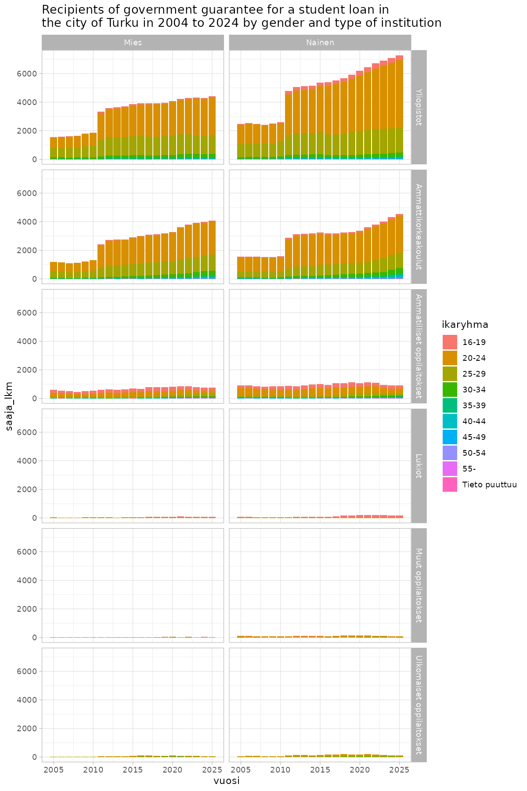

# Fetching data using kelaopendata

**Installation**

`kelaopendata` can be installed from GitHub using

``` r
# Install development version from GitHub
remotes::install_github("ropengov/kelaopendata")
```

``` r
# Let's first create a function that checks if the suggested 
# packages are available
check_namespaces <- function(pkgs){
  return(all(unlist(sapply(pkgs, requireNamespace,quietly = TRUE))))
}
```

## List available datasets

``` r
library(kelaopendata)
library(dplyr)

dsets <- list_datasets()
print(dsets, n = 50)
#> # A tibble: 30 × 3
#>    modified   name                                                         id   
#>    <date>     <chr>                                                        <chr>
#>  1 2026-04-07 maksetut-yleiset-asumistuet1                                 f80f…
#>  2 2026-04-07 kelan-maksamat-elake-etuudet                                 341d…
#>  3 2026-04-07 maksetut-takuuelakkeet                                       17cd…
#>  4 2026-04-07 perustoimeentulotuen-saajat                                  af7a…
#>  5 2026-04-07 tyomarkkinatuen-saajat-tukipaivien-kertyman-ja-korvausperus… 06fc…
#>  6 2026-04-07 kelan-tyottomyysetuudet-korvausperusteen-mukaan              3080…
#>  7 2026-03-27 kunnan-osarahoittaman-tyottomyysturvan-saajat-ja-maksetut-e… 4eea…
#>  8 2026-03-26 kunnan-osarahoittaman-tyottomyysturvan-saajat-ja-maksetut-e… 6090…
#>  9 2026-03-26 kunnan-osarahoittaman-tyottomyysturvan-saajat-ja-maksetut-e… 7c07…
#> 10 2026-03-20 etuuksien-ratkaisun-kooste                                   a11f…
#> 11 2026-03-16 voimassa-olleet-alkaneet-ja-paattyneet-laakekorvausoikeudet  7083…
#> 12 2026-03-16 suomen-tyokyvyttomyyselakkeensaajat-sairauden-mukaan         8be0…
#> 13 2026-03-16 takuuelakkeen-saajat-ja-keskimaaraiset-elakkeet              53d5…
#> 14 2026-03-16 suomen-elakkeensaajat-ja-keskimaaraiset-elakkeet             e88d…
#> 15 2026-03-16 sairauspaivarahojen-saajat-ja-maksetut-etuudet-sairauspaary… a2ce…
#> 16 2026-03-16 kelan-elake-etuuden-saajat-ja-keskimaaraiset-etuudet         8df7…
#> 17 2026-03-16 sairauspaivarahojen-saajat-ja-maksetut-etuudet-diagnooseitt… dd43…
#> 18 2026-03-16 lastenhoidon-tukien-saajat-ja-maksetut-tuet                  eb0c…
#> 19 2026-03-16 koulumatkatuen-saajat-ja-maksetut-tuet                       3937…
#> 20 2026-03-16 opintotuen-saajat-ja-maksetut-tuet                           6c4d…
#> 21 2026-03-16 kelan-etuuksien-saajat-ja-maksetut-etuudet                   9af3…
#> 22 2026-03-15 kuntien-rahoittama-tyomarkkinatuki                           970f…
#> 23 2026-03-15 kelan-maksaman-perustoimeentulotuen-menot-ja-palautukset     4b64…
#> 24 2026-03-15 perustoimeentulotuen-saajakotitaloudet                       802e…
#> 25 2026-03-15 vanhempainpaivarahojen-saajat-ja-maksetut-etuudet            fcec…
#> 26 2026-03-15 kelan-tyottomyysetuuksien-saajat-kuukauden-lopussa           4378…
#> 27 2026-03-15 kunnan-osarahoittaman-tyomarkkinatuen-saajat-ja-maksetut-et… 5dd6…
#> 28 2026-03-15 sairaanhoitokorvausten-saajat-ja-maksetut-korvaukset         2236…
#> 29 2025-12-11 etuuksien-ratkaisut                                          3fec…
#> 30 2025-05-14 helsingin-seudun-sairastavuusindeksi                         06f6…
```

## Obtaining data on Financial aid for students (opintotuki)

### Metadata

For this example we choose “Financial aid for students” as our benefit
of interest. First we download the metadata and print the description
field.

``` r
d_id <- dsets[dsets$name == "opintotuen-saajat-ja-maksetut-tuet", ]$id
meta <- get_metadata(data_id = d_id)
meta$description
#> [1] "Tämä tietoaineisto liittyy Kelan tilastotietokanta Kelaston dynaamiseen raporttiin Opintotuen saajat ja maksetut tuet.  \n\nAineistossa on tiedot opintotuen saajista, maksetuista tuista ja keskimääräisistä tuista tilastointijakson aikana. Opintotuen saajia ovat henkilöt, joille on maksettu tilastointijakson aikana säännöllinen tai takautuva opintoraha tai asumislisä, tai joilla on voimassa oleva opintolainan valtiontakaus. Maksettuihin tukiin on tilastoitu säännöllisten tai takautuvien maksujen lisäksi myös opintoetuuksien palautukset. Keskimääräiseen opintotukeen (euroa/saaja) on tilastoitu ainoastaan säännöllisesti maksetut tuet ja opintolainan valtiontakauksen euromäärä.\n\nOpintotuen saajat ja maksetut etuudet tilastoidaan kalenterivuosittain, lukuvuosittain ja kuukausittain. Lukuvuosi alkaa elokuun alussa ja päättyy seuraavan vuoden heinäkuun lopussa. Aineistossa on tietoja vuositasolla vuodesta 2005 alkaen, kuukausitasolla vuodesta 2018 alkaen ja lukuvuositasolla 2005/2006 alkaen.\n\nOppilaitosaste määräytyy etuuden maksutapahtumaan liittyvän oppilaitosnumeron perusteella. Oletusarvoisesti opintotuen saaja tilastoituu tilastointijakson viimeisimmän maksutapahtuman mukaiseen oppilaitosasteeseen. Valinnalla \"Astetiedon peruste: Kaikki oppilaitokset\" tuen saaja tilastoituu kaikkiin tilastointijakson maksutapahtumien mukaisiin oppilaitosasteisiin. Yhteissummassa tuen saaja esiintyy kuitenkin vain kerran.\n\nOppilaitosasteeseen \"Ulkomaiset oppilaitokset\" tilastoituvat ne opintotuen saajat, jotka suorittavat tutkintoa ulkomaisessa oppilaitoksessa.\n\nOpintotuen saajan ikä ja asuinkunta tilastoituvat valitun ajanjakson lopun tietojen mukaisesti. Lukuvuoden tiedoissa ikä ja asuinkunta ovat kuitenkin  lukuvuoteen sisältyvän syyslukukauden lopun tieto."
```

Then a more technical overview of the dataset, containing names of the
CSV files, CSV dialect, and values and types of each indicator in the
data.

``` r
jsonlite::toJSON(meta$resources, pretty = T)
#> [
#>   {
#>     "name": "opintotuen-saajat-ja-maksetut-tuet",
#>     "path": ["data_2005_2017.csv", "data_2018.csv", "data_2019.csv", "data_2020.csv", "data_2021.csv", "data_2022.csv", "data_2023.csv", "data_2024.csv", "data_2025.csv", "data_2026.csv"],
#>     "format": "csv",
#>     "dialect": {
#>       "delimiter": ","
#>     },
#>     "encoding": "UTF-8",
#>     "pathType": "local",
#>     "schema": {
#>       "fields": [
#>         {
#>           "name": "aikatyyppi",
#>           "type": "string",
#>           "format": "default",
#>           "values": ["Kuukausi", "Lukuvuosi", "Vuosi"],
#>           "description": "Tilaston aikajakso:\r\nVuosi\r\nLukuvuosi\r\nKuukausi, tilastointikuukauden tilanne"
#>         },
#>         {
#>           "name": "kuukausi_nro",
#>           "type": "integer",
#>           "format": "default",
#>           "values": [1, 2, 3, 4, 5, 6, 7, 8, 9, 10, 11, 12],
#>           "description": "Maksukuukauden numero."
#>         },
#>         {
#>           "name": "vuosikuukausi",
#>           "type": "integer",
#>           "format": "default",
#>           "values": [200512, 200607, 200612, 200707, 200712, 200807, 200812, 200907, 200912, 201007, 201012, 201107, 201112, 201207, 201212, 201307, 201312, 201407, 201412, 201507, 201512, 201607, 201612, 201707, 201712, 201801, 201802, 201803, 201804, 201805, 201806, 201807, 201808, 201809, 201810, 201811, 201812, 201901, 201902, 201903, 201904, 201905, 201906, 201907, 201908, 201909, 201910, 201911, 201912, 202001, 202002, 202003, 202004, 202005, 202006, 202007, 202008, 202009, 202010, 202011, 202012, 202101, 202102, 202103, 202104, 202105, 202106, 202107, 202108, 202109, 202110, 202111, 202112, 202201, 202202, 202203, 202204, 202205, 202206, 202207, 202208, 202209, 202210, 202211, 202212, 202301, 202302, 202303, 202304, 202305, 202306, 202307, 202308, 202309, 202310, 202311, 202312, 202401, 202402, 202403, 202404, 202405, 202406, 202407, 202408, 202409, 202410, 202411, 202412, 202501, 202502, 202503, 202504, 202505, 202506, 202507, 202508, 202509, 202510, 202511, 202512, 202601, 202602],
#>           "description": "Maksuvuosi ja kuukausi, muotoa VVVVKK."
#>         },
#>         {
#>           "name": "vuosi",
#>           "type": "integer",
#>           "format": "default",
#>           "values": [2005, 2006, 2007, 2008, 2009, 2010, 2011, 2012, 2013, 2014, 2015, 2016, 2017, 2018, 2019, 2020, 2021, 2022, 2023, 2024, 2025, 2026],
#>           "description": "Maksuvuosi."
#>         },
#>         {
#>           "name": "kunta_nro",
#>           "type": "string",
#>           "format": "default",
#>           "values": ["004", "005", "006", "009", "010", "015", "016", "017", "018", "019", "020", "035", "040", "043", "044", "045", "046", "047", "049", "050", "051", "052", "060", "061", "069", "071", "072", "073", "074", "075", "076", "077", "078", "079", "081", "082", "083", "084", "085", "086", "090", "091", "092", "095", "097", "098", "099", "101", "102", "103", "105", "106", "108", "109", "111", "139", "140", "142", "143", "145", "146", "148", "149", "150", "151", "152", "153", "163", "164", "165", "167", "169", "170", "171", "172", "173", "174", "175", "176", "177", "178", "179", "180", "181", "182", "183", "186", "199", "202", "204", "205", "208", "210", "211", "213", "214", "216", "217", "218", "220", "223", "224", "226", "227", "230", "231", "232", "233", "235", "236", "239", "240", "241", "243", "244", "245", "246", "247", "248", "249", "250", "252", "254", "255", "256", "257", "259", "260", "261", "262", "263", "265", "266", "271", "272", "273", "275", "276", "277", "279", "280", "281", "283", "284", "285", "286", "287", "288", "289", "290", "291", "292", "297", "300", "301", "303", "304", "305", "306", "308", "309", "310", "312", "315", "316", "317", "319", "320", "322", "398", "399", "400", "401", "402", "403", "405", "406", "407", "408", "410", "413", "414", "415", "416", "418", "419", "420", "421", "422", "423", "424", "425", "426", "429", "430", "433", "434", "435", "436", "439", "440", "441", "442", "443", "444", "445", "475", "476", "478", "479", "480", "481", "482", "483", "484", "485", "489", "490", "491", "493", "494", "495", "498", "499", "500", "501", "503", "504", "505", "506", "507", "508", "529", "531", "532", "533", "534", "535", "536", "537", "538", "540", "541", "543", "544", "545", "559", "560", "561", "562", "563", "564", "567", "573", "576", "577", "578", "580", "581", "583", "584", "585", "586", "587", "588", "592", "593", "595", "598", "599", "601", "602", "603", "604", "606", "607", "608", "609", "611", "614", "615", "616", "617", "618", "619", "620", "623", "624", "625", "626", "630", "631", "632", "633", "635", "636", "638", "640", "678", "680", "681", "682", "683", "684", "686", "687", "689", "691", "692", "694", "696", "697", "698", "699", "700", "701", "702", "704", "705", "707", "708", "710", "729", "732", "734", "737", "738", "739", "740", "741", "742", "743", "746", "747", "748", "749", "751", "753", "754", "755", "758", "759", "761", "762", "765", "768", "770", "772", "774", "775", "776", "777", "778", "781", "783", "784", "785", "790", "791", "831", "832", "833", "834", "835", "837", "838", "844", "845", "846", "848", "849", "850", "851", "853", "854", "855", "857", "858", "859", "863", "864", "885", "886", "887", "889", "890", "892", "893", "895", "905", "906", "908", "909", "911", "912", "913", "915", "916", "918", "920", "921", "922", "923", "924", "925", "926", "927", "928", "931", "932", "933", "934", "935", "936", "940", "942", "944", "945", "946", "971", "972", "973", "975", "976", "977", "978", "979", "980", "981", "988", "989", "992"],
#>           "description": "Kunnan numero tilastointijakson lopulla. Lukuvuoden tiedoissa aluetieto on kuitenkin lukuvuoteen sisältyvän syyslukukauden lopun tieto.\r\nTilastokeskuksen kuntaluokittelu.\r\nArvo 199 tarkoittaa, että ryhmän lukumäärä on alle 4 tai tieto puuttuu.\r\nEnnen vuotta 2014 lakanneet kunnat saavat nimeksi kunnan numeron."
#>         },
#>         {
#>           "name": "kunta_nimi",
#>           "type": "string",
#>           "format": "default",
#>           "values": ["004", "006", "015", "017", "040", "044", "045", "073", "083", "084", "085", "095", "101", "150", "163", "173", "175", "180", "183", "210", "220", "223", "227", "243", "246", "247", "248", "252", "254", "255", "259", "262", "266", "277", "279", "281", "289", "292", "303", "306", "308", "310", "315", "401", "406", "414", "415", "419", "424", "429", "439", "443", "479", "482", "485", "490", "493", "501", "506", "533", "534", "537", "540", "544", "559", "567", "573", "585", "586", "587", "602", "603", "606", "617", "618", "632", "633", "640", "682", "692", "696", "699", "701", "705", "708", "737", "741", "754", "770", "772", "774", "775", "776", "784", "835", "855", "863", "864", "885", "906", "909", "912", "913", "916", "920", "923", "926", "928", "932", "933", "940", "942", "944", "945", "971", "972", "973", "975", "978", "979", "988", "Äänekoski", "Ähtäri", "Akaa", "Alajärvi", "Alavieska", "Alavus", "Asikkala", "Askola", "Aura", "Brändö", "Eckerö", "Enonkoski", "Enontekiö", "Espoo", "Eura", "Eurajoki", "Evijärvi", "Finström", "Forssa", "Haapajärvi", "Haapavesi", "Hailuoto", "Halsua", "Hämeenkoski", "Hämeenkyrö", "Hämeenlinna", "Hamina", "Hammarland", "Hankasalmi", "Hanko", "Harjavalta", "Hartola", "Hattula", "Hausjärvi", "Heinävesi", "Heinola", "Helsinki", "Hirvensalmi", "Hollola", "Honkajoki", "Huittinen", "Humppila", "Hyrynsalmi", "Hyvinkää", "Ii", "Iisalmi", "Iitti", "Ikaalinen", "Ilmajoki", "Ilomantsi", "Imatra", "Inari", "Inkoo", "Isojoki", "Isokyrö", "Jalasjärvi", "Jämijärvi", "Jämsä", "Janakkala", "Järvenpää", "Joensuu", "Jokioinen", "Jomala", "Joroinen", "Joutsa", "Juankoski", "Juuka", "Juupajoki", "Juva", "Jyväskylä", "Kaarina", "Kaavi", "Kajaani", "Kalajoki", "Kangasala", "Kangasniemi", "Kankaanpää", "Kannonkoski", "Kannus", "Karijoki", "Karkkila", "Kärkölä", "Kärsämäki", "Karstula", "Karvia", "Kaskinen", "Kauhajoki", "Kauhava", "Kauniainen", "Kaustinen", "Keitele", "Kemi", "Kemijärvi", "Keminmaa", "Kemiönsaari", "Kempele", "Kerava", "Keuruu", "Kihniö", "Kinnula", "Kirkkonummi", "Kitee", "Kittilä", "Kiuruvesi", "Kivijärvi", "Kokemäki", "Kokkola", "Kolari", "Konnevesi", "Kontiolahti", "Korsnäs", "Koski Tl", "Kotka", "Kouvola", "Köyliö", "Kristiinankaupunki", "Kruunupyy", "Kuhmo", "Kuhmoinen", "Kuopio", "Kuortane", "Kurikka", "Kustavi", "Kuusamo", "Kyyjärvi", "Lahti", "Laihia", "Laitila", "Lapinjärvi", "Lapinlahti", "Lappajärvi", "Lappeenranta", "Lapua", "Laukaa", "Lavia", "Lemi", "Lempäälä", "Leppävirta", "Lestijärvi", "Lieksa", "Lieto", "Liminka", "Liperi", "Lohja", "Loimaa", "Loppi", "Loviisa", "Luhanka", "Lumijoki", "Luoto", "Luumäki", "Luvia", "Maalahti", "Maaninka", "Maarianhamina", "Mäntsälä", "Mänttä-Vilppula", "Mäntyharju", "Marttila", "Masku", "Merijärvi", "Merikarvia", "Miehikkälä", "Mikkeli", "Muhos", "Multia", "Muonio", "Mustasaari", "Muurame", "Mynämäki", "Myrskylä", "Naantali", "Nakkila", "Närpiö", "Nastola", "Nivala", "Nokia", "Nousiainen", "Nurmes", "Nurmijärvi", "Orimattila", "Oripää", "Orivesi", "Oulainen", "Oulu", "Outokumpu", "Padasjoki", "Paimio", "Pälkäne", "Paltamo", "Parainen", "Parikkala", "Parkano", "Pedersören kunta", "Pelkosenniemi", "Pello", "Perho", "Pertunmaa", "Petäjävesi", "Pieksämäki", "Pielavesi", "Pietarsaari", "Pihtipudas", "Pirkkala", "Polvijärvi", "Pomarkku", "Pori", "Pornainen", "Porvoo", "Posio", "Pöytyä", "Pudasjärvi", "Pukkila", "Punkalaidun", "Puolanka", "Puumala", "Pyhäjärvi", "Pyhäjoki", "Pyhäntä", "Pyhäranta", "Pyhtää", "Raahe", "Rääkkylä", "Raasepori", "Raisio", "Rantasalmi", "Ranua", "Rauma", "Rautalampi", "Rautavaara", "Rautjärvi", "Reisjärvi", "Riihimäki", "Ristijärvi", "Rovaniemi", "Ruokolahti", "Ruovesi", "Rusko", "Saarijärvi", "Säkylä", "Salla", "Salo", "Sastamala", "Sauvo", "Savitaipale", "Savonlinna", "Savukoski", "Seinäjoki", "Sievi", "Siikainen", "Siikajoki", "Siikalatva", "Siilinjärvi", "Simo", "Sipoo", "Siuntio", "Sodankylä", "Soini", "Somero", "Sonkajärvi", "Sotkamo", "Sulkava", "Suomussalmi", "Suonenjoki", "Sysmä", "Taipalsaari", "Taivalkoski", "Taivassalo", "Tammela", "Tampere", "Tarvasjoki", "Tervo", "Tervola", "Teuva", "Tohmajärvi", "Toholampi", "Toivakka", "Tornio", "Tuntematon", "Turku", "Tuusniemi", "Tuusula", "Tyrnävä", "Ulvila", "Urjala", "Utajärvi", "Utsjoki", "Uurainen", "Uusikaarlepyy", "Uusikaupunki", "Vaala", "Vaasa", "Valkeakoski", "Valtimo", "Vantaa", "Varkaus", "Vehmaa", "Vesanto", "Vesilahti", "Veteli", "Vieremä", "Vihti", "Viitasaari", "Vimpeli", "Virolahti", "Virrat", "Vöyri", "Ylitornio", "Ylivieska", "Ylöjärvi", "Ypäjä"],
#>           "description": "Kunnan nimi tilastointijakson lopulla. Lukuvuoden tiedoissa aluetieto on kuitenkin lukuvuoteen sisältyvän syyslukukauden lopun tieto.\r\nTilastokeskuksen kuntaluokittelu. (Huom! Ennen vuotta 2014 lakanneiden kuntien nimet näkyvät aineistossa kuntanumerona).\r\nPuuttuvan/piilotetun tiedon vakioteksti: 'Tuntematon'."
#>         },
#>         {
#>           "name": "ikaryhma",
#>           "type": "string",
#>           "format": "default",
#>           "values": ["16-19", "20-24", "25-29", "30-34", "35-39", "40-44", "45-49", "50-54", "55-", "Tieto puuttuu"],
#>           "description": "Saajan ikäryhmä tilastointijakson lopussa. Lukuvuoden tiedoissa ikä on kuitenkin ikä lukuvuoteen sisältyvän syyslukukauden lopussa.\r\nIkäryhmä (16–19 v, 20–24 v, …, 50–54 v, yli 54 v)\r\nTieto puuttuu, ryhmän lukumäärä on alle 4 tai tieto puuttuu. Puuttuvan/piilotetun tiedon vakioteksti: 'Tieto puuttuu'."
#>         },
#>         {
#>           "name": "sukupuoli",
#>           "type": "string",
#>           "format": "default",
#>           "values": ["Mies", "Nainen", "Tuntematon"],
#>           "description": "Sukupuoli:\r\nMies\r\nNainen\r\nTuntematon, ryhmän lukumäärä on alle 4 tai tieto puuttuu. Puuttuvan/piilotetun tiedon vakioteksti: 'Tuntematon'."
#>         },
#>         {
#>           "name": "etuus",
#>           "type": "string",
#>           "format": "default",
#>           "values": ["Aikuisopintoraha", "Asumislisä", "Opintolainan valtiontakaus", "Opintoraha", "Opintoraha ja asumislisä yhteensä", "Yhteensä"],
#>           "description": "Yhteensä, Opintoraha ja asumislisä yhteensä, \r\nOpintoraha, Asumislisä, aiemmin maksettu Aikuisopintoraha \r\nja Opintolainan valtiontakaus\r\nPuuttuvan/piilotetun tiedon vakioteksti: 'Tieto puuttuu'."
#>         },
#>         {
#>           "name": "oppilaitos_peruste",
#>           "type": "string",
#>           "format": "default",
#>           "values": ["Kaikki oppilaitokset", "Viimeisin oppilaitos"],
#>           "description": "Oppilaitosasteen peruste\r\nKaikki oppilaitokset                                                                                                    \r\nViimeisin oppilaitos   "
#>         },
#>         {
#>           "name": "oppilaitosaste",
#>           "type": "string",
#>           "format": "default",
#>           "values": ["Ammatilliset oppilaitokset", "Ammattikorkeakoulut", "Lukiot", "Muut oppilaitokset", "Tieto puuttuu", "Ulkomaiset oppilaitokset", "Yhteensä", "Yliopistot"],
#>           "description": "Oppilaitosaste\r\nYliopistot, Ammattikorkeakoulut, Ammatilliset oppilaitokset, Lukiot, Muut oppilaitokset ja Ulkomaiset oppilaitokset\r\nPuuttuvan/piilotetun tiedon vakioteksti: 'Tieto puuttuu'."
#>         },
#>         {
#>           "name": "saaja_lkm",
#>           "type": "number",
#>           "format": "default",
#>           "values": [0, 15666],
#>           "description": "Saajien lukumäärä"
#>         },
#>         {
#>           "name": "saaja_laskenta_lkm",
#>           "type": "number",
#>           "format": "default",
#>           "values": [0, 15628],
#>           "description": "Keskimääräisen etuuden laskentaan tarvittava saajamäärä tarkastelujakson aikana."
#>         },
#>         {
#>           "name": "maksettu_eur",
#>           "type": "number",
#>           "format": "default",
#>           "values": [-10307222.69, 50169562.06],
#>           "description": "Maksetun etuuden rahamäärä bruttona, palautuksissa saa negatiivisen arvon."
#>         },
#>         {
#>           "name": "maksettu_laskenta_eur",
#>           "type": "number",
#>           "format": "default",
#>           "values": [0, 128082527.65],
#>           "description": "Keskimääräisen etuuden laskentaan tarvittava euromäärä tarkastelujakson aikana."
#>         }
#>       ],
#>       "missingValues": [""]
#>     },
#>     "profile": "data-resource"
#>   }
#> ]
```

A more dense view of variables and their types and descriptions can be
printed with

``` r
meta$resources$schema$fields[[1]] |>
  select(-values) |>
  as_tibble()
#> # A tibble: 15 × 4
#>    name                  type    format  description                            
#>    <chr>                 <chr>   <chr>   <chr>                                  
#>  1 aikatyyppi            string  default "Tilaston aikajakso:\r\nVuosi\r\nLukuv…
#>  2 kuukausi_nro          integer default "Maksukuukauden numero."               
#>  3 vuosikuukausi         integer default "Maksuvuosi ja kuukausi, muotoa VVVVKK…
#>  4 vuosi                 integer default "Maksuvuosi."                          
#>  5 kunta_nro             string  default "Kunnan numero tilastointijakson lopul…
#>  6 kunta_nimi            string  default "Kunnan nimi tilastointijakson lopulla…
#>  7 ikaryhma              string  default "Saajan ikäryhmä tilastointijakson lop…
#>  8 sukupuoli             string  default "Sukupuoli:\r\nMies\r\nNainen\r\nTunte…
#>  9 etuus                 string  default "Yhteensä, Opintoraha ja asumislisä yh…
#> 10 oppilaitos_peruste    string  default "Oppilaitosasteen peruste\r\nKaikki op…
#> 11 oppilaitosaste        string  default "Oppilaitosaste\r\nYliopistot, Ammatti…
#> 12 saaja_lkm             number  default "Saajien lukumäärä"                    
#> 13 saaja_laskenta_lkm    number  default "Keskimääräisen etuuden laskentaan tar…
#> 14 maksettu_eur          number  default "Maksetun etuuden rahamäärä bruttona, …
#> 15 maksettu_laskenta_eur number  default "Keskimääräisen etuuden laskentaan tar…
```

### Querying, downloading and plotting the data

Let’s get data on recipients of student loans in the city of Turku using
[`kelaopendata::get_data()`](https://ropengov.github.io/kelaopendata/reference/get_data.md)
function.

``` r
d_opintotuki <- kelaopendata::get_data(
  data_id = d_id,
  sql = "WHERE etuus = 'Opintolainan valtiontakaus' AND
                            aikatyyppi = 'Vuosi' AND
                            kunta_nimi = 'Turku' AND
                            etuus = 'Opintolainan valtiontakaus' AND
                            oppilaitos_peruste = 'Viimeisin oppilaitos'
                           "
)
d_opintotuki
#> # A tibble: 1,815 × 15
#>    aikatyyppi kuukausi_nro vuosikuukausi vuosi kunta_nro kunta_nimi ikaryhma    
#>    <chr>             <dbl>         <dbl> <dbl> <chr>     <chr>      <chr>       
#>  1 Vuosi                12        202512  2025 853       Turku      Tieto puutt…
#>  2 Vuosi                12        202512  2025 853       Turku      Tieto puutt…
#>  3 Vuosi                12        202512  2025 853       Turku      55-         
#>  4 Vuosi                12        202512  2025 853       Turku      55-         
#>  5 Vuosi                12        202512  2025 853       Turku      55-         
#>  6 Vuosi                12        202512  2025 853       Turku      55-         
#>  7 Vuosi                12        202512  2025 853       Turku      55-         
#>  8 Vuosi                12        202512  2025 853       Turku      55-         
#>  9 Vuosi                12        202512  2025 853       Turku      55-         
#> 10 Vuosi                12        202512  2025 853       Turku      55-         
#> # ℹ 1,805 more rows
#> # ℹ 8 more variables: sukupuoli <chr>, etuus <chr>, oppilaitos_peruste <chr>,
#> #   oppilaitosaste <chr>, saaja_lkm <dbl>, saaja_laskenta_lkm <dbl>,
#> #   maksettu_eur <dbl>, maksettu_laskenta_eur <dbl>
```

Next, let’s filter the data locally in R a bit more.

``` r
d_plot <- d_opintotuki %>%
  # Exclude
  filter(sukupuoli != "Tuntematon",!oppilaitosaste %in% c("Tieto puuttuu", "Yhteensä")) %>%
  mutate(oppilaitosaste = factor(
    oppilaitosaste,
    levels = c(
      "Yliopistot",
      "Ammattikorkeakoulut",
      "Ammatilliset oppilaitokset",
      "Lukiot",
      "Muut oppilaitokset",
      "Ulkomaiset oppilaitokset"
    )
  ))
```

Finally, let’s draw a plot on recipients by gender and type of
institution

``` r
library(ggplot2)
ggplot(d_plot, aes(x = vuosi, y = saaja_lkm, fill = ikaryhma)) +
  geom_col(position = position_stack()) +
  facet_grid(oppilaitosaste ~ sukupuoli) +
  labs(title = "Recipients of government guarantee for a student loan in\nthe city of Turku in 2004 to 2024 by gender and type of institution") +
  theme_light()
```


